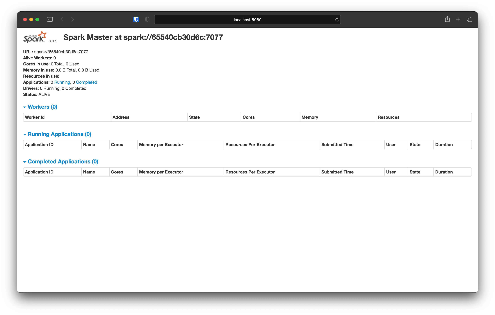
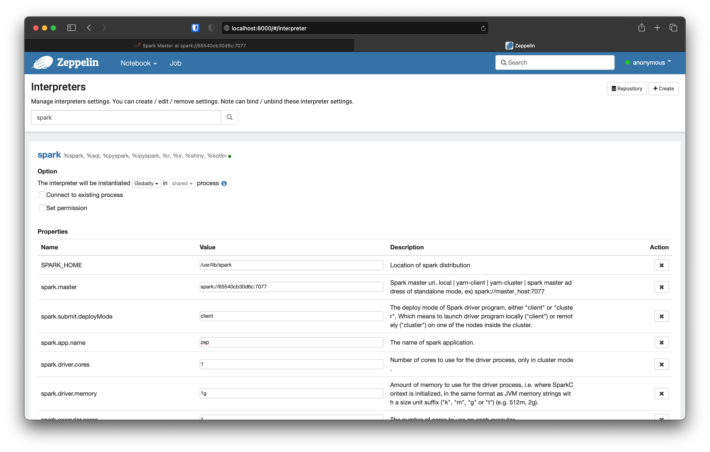

# Vince's Zeppelin

This is an Apache Zeppelin image. It's built on top of `vforgione/data-base` with contributions from `vforgione/spark-standalone` and `apache/zeppelin`.

**Zeppelin Version:** 0.9.0  
**Spark Version:** 3.0.1  
**Haddop Version:** 2.7

## What's Included?

- Everything from the base image
- $SPARK_HOME from `vforgione/spark-standalone`
- $ZEPPELIN_HOME from `apache/zeppelin`
- `apt` Installations:
  - openjdk-8-jre-headless
  - tini
- Envrionment Variables:
  - Z_VERSION="0.9.0"
  - ZEPPELIN_HOME="/usr/lib/zeppelin"
  - HOME="/usr/lib/zeppelin"
  - ZEPPELIN_ADDR="0.0.0.0"

## Ports

I recommend mapping the container port 8080 to 8000 on your host machine. You're most likely going to be running Spark with this container, and that uses port 8080 for the admin interface.

## Running with a Spark Container

The best way to run Zeppelin is with another Spark container.

First, start up both containers:

```shell
docker network create spark-zep
docker run --network spark-zep -p 4040:4040 -p 7077:7077 -p 8080:8080 -p 8081:8081 -p 8888:8888 vforgione/spark-standalone
docker run --network spark-zep -p 8000:8080 vforgione/zeppelin
```

Next, go to [localhost:8080](localhost:8080) and copy the URL value from the Spark Admin. It will look like `spark://${container hash}:7077`.



Next, go to [localhost:8000/#/interpreter](localhost:8000/#/interpreter), and edit the _spark_ interpreter config:

- `spark.master` should be changed to the URL you copied from the Spark Admin
- `spark.submit.deployMode` should be changed to `client`
- add a value for `spark.app.name`
- make any other additional tweaks you want to the driver and executor configs
- save



## Entrypoint

The entrypoint script for this image is [tini](https://github.com/krallin/tini).

## Default Command

The default command starts the Zeppelin Server (`bin/zeppelin.sh`).
